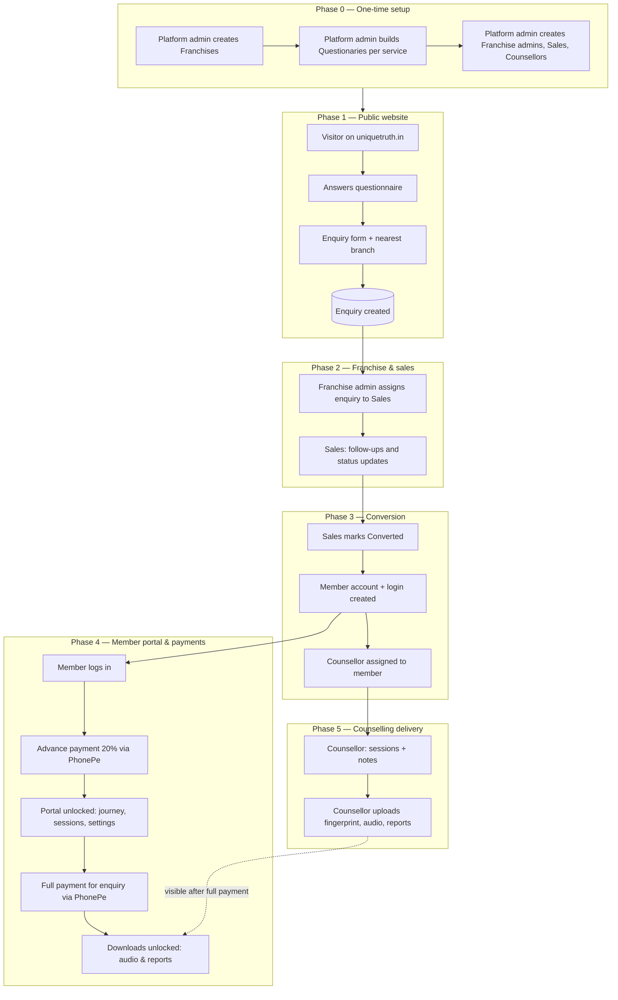

# Unique Truth — How the Application Works (Complete Flow)

**Live app:** [https://uniquetruth.in/](https://uniquetruth.in/)  
**Staff login:** [https://uniquetruth.in/login](https://uniquetruth.in/login)

This document explains the **full journey** through Unique Truth: what was built, who uses each part, and how everything connects from a visitor on the website to a paying member receiving counselling.

---

## The big picture in one paragraph

A **visitor** learns about services on the public website and submits an **enquiry** (questionnaire + contact details + location). The system routes the lead to the **nearest franchise**. The **franchise admin** assigns it to **sales**. **Sales** follows up and marks the lead **converted** when the client commits. The client becomes a **member** with a login to the **member portal**, pays an **advance** to unlock the portal, works with a **counsellor** (sessions + uploaded recordings/reports), then pays the **remaining balance** to **download** those files. **Platform admin** sets up franchises, questionnaires, staff accounts, and oversees the network. **Careers** and **contact** run alongside this on the public site.

---

## Complete flow (visual)

---

## Phase 0 — What must exist before leads flow

Platform admin prepares the system **once** (and updates when needed). Nothing in the public enquiry flow works well without this foundation.

| What is created | Why it matters |
|-----------------|----------------|
| **Franchises** (branches with location) | Public form finds the **nearest branch**; enquiries belong to a franchise |
| **Questionaries** (questions per service) | Visitors answer these on Skills / Behavioral / Relationship / Talent / Complete Package pages |
| **Users** — Franchise admin, Sales, Counsellor | Each person logs in and sees only their part of the flow |
| **Carriers** (job openings, optional) | Powers the **Careers** section on the homepage |

**Franchise admin** (created by platform admin) then builds their own **team**: more **sales** and **counsellors** for that branch. Counsellors created here must have a **counseling level** (Basic / Standard / Premium / Intensive) — the same levels members choose when paying.

---

## Phase 1 — Visitor becomes an enquiry

**Where:** Public website (no login).

### Step-by-step

1. Visitor opens [https://uniquetruth.in/](https://uniquetruth.in/) or a service page (e.g. Complete Package, Skills Behind Studies).
2. Clicks **Enquire** or lands on a service from the menu.
3. **Questionnaire** — answers one question at a time (content defined in admin **Questionaries**).
4. **Enquiry form** — name, phone, email, gender, age.
5. **Location** — searches area on map; system picks **nearest franchise**.
6. **Submit** — an **enquiry** record is created in the database and appears in admin/franchise/sales views.

**Complete Package** runs questionnaires from all four individual services (plus package-specific questions) in one long flow.

**Separate paths on the same site:**

- **Contact form** — general message only (no full questionnaire).
- **Careers** — browse open jobs (from **Carriers**), filter by role, read details, apply via contact (no login).

---

## Phase 2 — Enquiry is owned and worked by the branch

**Who:** Franchise admin → Sales.

### Franchise admin

1. Logs in → **Enquiries** (all enquiries for **their franchise only**).
2. Already-assigned leads show who owns them.

### Sales

1. Logs in → **Enquiries** (leads assigned to them).
2. Opens an enquiry → side panel with full detail and history.
3. **Adds follow-up notes** after each call or meeting.
4. Moves **status** through the pipeline:

| Status | Meaning in the flow |
|--------|---------------------|
| **New** | Just arrived; not contacted yet |
| **In progress** | Sales is actively working the lead |
| **Converted** | Client agreed — handoff to member + counsellor process |
| **Closed** | Lead ended without becoming a client |

Sales does **not** assign counsellors manually in most cases — **Converted** triggers backend logic (counsellor assignment for the franchise).

---

## Phase 3 — Lead becomes a member

**What “Converted” means in the system**

- The enquiry is no longer a “lead”; the person is a **client**.
- A **member account** (`user` role) is created with email/password (your operations team or backend process provides credentials to the client).
- A **counsellor** is linked to the case (auto-assigned within the franchise when conversion happens).

Until this step, there is **no member portal** for that person.

---

## Phase 4 — Member portal and payments

**Where:** [https://uniquetruth.in/login](https://uniquetruth.in/login) → Member portal.

### First login — payment gate

1. Member signs in with credentials.
2. If **advance payment** is not completed, they see the **payment screen** (not the full dashboard).
3. They choose **counseling level** (Basic / Standard / Premium / Intensive).
4. App shows **total program price**, **20% advance**, and **remaining balance**.
5. **Continue to PhonePe** → pay → return to `https://uniquetruth.in/portal/payment/return`.
6. On success → **portal unlocks**.

**What advance payment unlocks**

- Home dashboard  
- **My journey** (their enquiry/program)  
- **Sessions** (counselling appointments)  
- **Privacy** (password, data export, requests)  

**What advance does *not* unlock**

- Downloading counsellor **audio** and **reports** (needs full payment below).

### Second payment — full balance (per enquiry)

1. Member opens **My journey** → selects their enquiry.
2. Recordings and reports appear **locked** until full payment.
3. Clicks **Unlock** → pays **remaining 80%** (balance) via PhonePe for that enquiry.
4. After confirmation → **Download** works on each file.

### Pricing (how the app calculates amounts)

| | Single service | Complete Package |
|---|----------------|------------------|
| Base (Basic level) | ₹10,000 | ₹25,000 |
| + Standard | +₹2,500 | +₹2,500 |
| + Premium | +₹5,000 | +₹5,000 |
| + Intensive | +₹7,500 | +₹7,500 |

- **Advance** = 20% of total  
- **Full payment** = rest of total for that program  

---

## Phase 5 — Counsellor delivers the service

**Who:** Counsellor (assigned at conversion).

Runs **in parallel** with Phase 4 — often starts after advance payment, while member may still owe full balance.

### Assigned users

1. Counsellor opens **Assigned users** → picks the member/enquiry.
2. Uploads:
   - **Fingerprint** image  
   - **Audio** (session recordings)  
   - **Reports** (PDF/documents)  

Files go to secure storage; the **member sees them in the portal** but can only **download after full payment**.

### Sessions

1. **Sessions** list/calendar shows scheduled appointments.
2. Open a session → add **notes**, set status: **Completed**, **Cancelled**, or **No show**.
3. Member sees session info in their portal **Sessions** area.

---

## How everything fits together

| Piece in the app | Connected to |
|------------------|--------------|
| **Questionary** (admin) | Public service pages visitors fill out |
| **Franchise** (admin) | Nearest branch on enquiry form; scopes franchise admin & sales |
| **Enquiry** | Created from public form; assigned by franchise admin; worked by sales |
| **Conversion** | Creates member login + counsellor assignment |
| **Counseling level** | Chosen by member at advance pay; affects total price |
| **Advance payment** | Unlocks member portal |
| **Sessions** | Counsellor updates; member views |
| **Media uploads** | Counsellor uploads; member downloads after full payment |
| **Full payment** | Tied to one **enquiry**; unlocks downloads for that enquiry |
| **Carriers** | Job posts → **Careers** on homepage |

---

## Who touches the enquiry at each stage

| Stage | Platform admin | Franchise admin | Sales | Counsellor | Member |
|-------|----------------|-----------------|-------|------------|--------|
| Setup franchises & questionnaires | ✓ | | | | |
| Create branch staff | ✓ | ✓ (sales/counsellor only) | | | |
| Public enquiry submitted | sees all | sees branch | — | — | — |
| Assign to sales | | ✓ | | | | |
| Follow-up & convert | | | ✓ | | | |
| Sessions & uploads | | | | ✓ | views |
| Advance payment | | | | | ✓ |
| Full payment & downloads | | | | | ✓ |
| Post jobs (careers) | ✓ | ✓ (branch) | | | |

---

## Login — where each role lands

| Role | After login they go to |
|------|-------------------------|
| Platform admin | Questionaries |
| Franchise admin | Team |
| Sales | Enquiries |
| Counsellor | Dashboard |
| Member | Portal (payment screen first if advance unpaid) |

Everyone uses the same login page; the app routes by role automatically.

---

## End-to-end story (example)

1. **Riya** visits the site, completes **Talent Awareness** questions, submits enquiry; nearest branch is **Mumbai franchise**.
2. **Franchise admin** assigns Riya’s enquiry to **Sales — Arjun**.
3. **Arjun** calls Riya, adds notes, sets **In progress**, then **Converted**.
4. Riya receives portal login. Logs in, picks **Standard** level, pays **20% advance** on PhonePe; portal opens.
5. **Counsellor Priya** is assigned; runs sessions, uploads a report and a recording.
6. Riya opens **My journey**, pays **remaining balance**, downloads Priya’s files.
7. Meanwhile on the site, a job seeker filters **Careers** for “Counsellor” roles and contacts via the contact section.

That is the full loop the application was built for.

---

## Quick daily use (by role)

**Platform admin** — Maintain franchises, questionnaires, users; monitor enquiries and carriers network-wide.

**Franchise admin** — Add sales/counsellors; assign new enquiries; manage branch job posts.

**Sales** — Work your enquiry list; notes + status until converted or closed.

**Counsellor** — Sessions for assigned members; upload fingerprint, audio, reports.

**Member** — Pay advance → use portal → pay full balance → download counsellor files; attend/view sessions.

---

## If something breaks the flow

| Problem | Likely cause |
|---------|----------------|
| Payment succeeds but portal stays locked | Wait and use “I already paid — refresh”; check PhonePe callback on production server |
| Redirect after payment goes to wrong URL | Redeploy frontend; backend `FRONTEND_URL` should be `https://uniquetruth.in` |
| Member cannot download files | Full payment for that enquiry not completed (advance alone is not enough) |
| Sales sees no enquiries | Franchise admin has not assigned leads to them |
| Careers empty | No active **Carriers** created for franchises |
| Questionnaire missing on service page | No **Questionary** published for that service in admin |

---

*This guide describes how the Unique Truth application works as one connected system. For URL reference: home `https://uniquetruth.in/`, login `https://uniquetruth.in/login`, member portal `https://uniquetruth.in/portal/dashboard`.*
